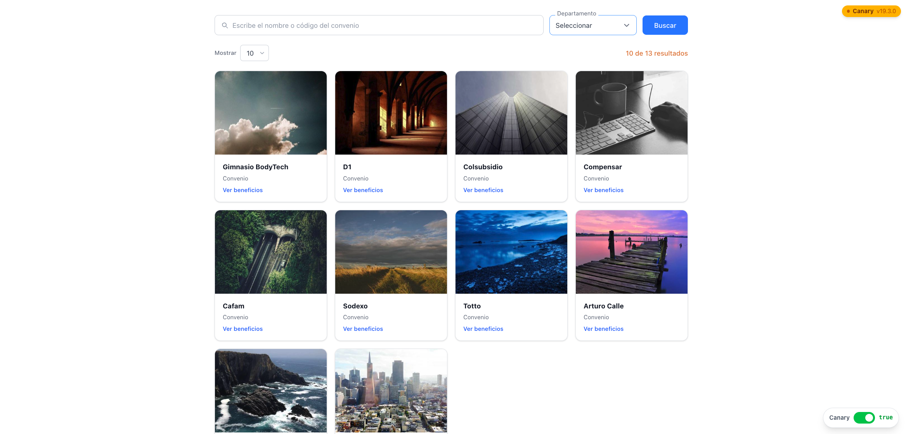

# Reto Semillero Arquitectura — Buscador de convenios bancarios

Aplicación **React** que replica el diseño de un buscador de convenios de pago bancarios con estilo fintech LATAM. El repositorio incluye **dos frontends paralelos** del mismo producto para comparar versiones de React en desarrollo.

| Versión    | Carpeta             | React                       | Puerto (dev) |
| :--------- | :------------------ | :-------------------------- | :----------- |
| **Stable** | `convenios-stable/` | 19.2.6 (última estable)     | **5173**     |
| **Canary** | `convenios-canary/` | 19.3.0-canary (pre-release) | **5174**     |

---

## Tabla de contenidos

1. [Captura del diseño objetivo](#captura-del-diseño-objetivo)
2. [Funcionalidades](#funcionalidades-implementadas)
3. [Stack tecnológico](#stack-tecnológico)
4. [Estructura del proyecto](#estructura-del-proyecto)
5. [Inicio rápido](#inicio-rápido)
6. [Scripts](#scripts-disponibles)
7. [Diferencias entre versiones](#diferencias-entre-versiones)
8. [Decisiones de diseño](#decisiones-de-diseño)
9. [API y variables de entorno](#api-y-variables-de-entorno)
10. [Build y despliegue](#build-y-despliegue)

---

## Captura del diseño objetivo

`.

---

## Funcionalidades implementadas

| Área                        | Detalle                                                                                                                             |
| :-------------------------- | :---------------------------------------------------------------------------------------------------------------------------------- |
| **Búsqueda en dos fases**   | El usuario escribe en el input; la búsqueda se aplica solo al pulsar **Buscar** o **Enter** (evita re-renders mientras se escribe). |
| **Filtro por departamento** | Dropdown con label flotante, listo para conectar a datos reales.                                                                    |
| **Grid de tarjetas**        | Cuatro columnas, responsive (2 → 3 → 4); logo/color del banco y nombre del convenio.                                                |
| **Hover**                   | Sobre la tarjeta aparecen **Pagar** e **Inscribir** con overlay sobre el logo.                                                      |
| **“Mostrar N”**             | Tamaño de página (5, 10, 25, 50) y vuelta a la primera página.                                                                      |
| **Contador**                | Muestra `N de M resultados` tras la búsqueda.                                                                                       |
| **Paginación**              | Primera, última y páginas vecinas a la activa, con ellipsis.                                                                        |
| **API**                     | Listado desde `VITE_CONVENIOS_API_URL` definida en `.env`.                                                                          |

---

## Stack tecnológico

| Herramienta  | Versión                      |
| :----------- | :--------------------------- |
| React        | 19.2.6 / 19.3.0-canary       |
| Vite         | ^8.0.12                      |
| Tailwind CSS | ^4.3.0 (`@tailwindcss/vite`) |
| ESLint       | ^10.3.0                      |
| Node.js      | >= 20                        |

> **Tailwind v4:** no requiere `tailwind.config.js`. La configuración base es `@import "tailwindcss"` en `src/index.css`.

---

## Estructura del proyecto

```text
reto_semillero_arquitectura/
├── README.md
├── convenios-stable/
│   ├── index.html
│   ├── package.json
│   ├── vite.config.js
│   ├── eslint.config.js
│   └── src/
│       ├── .env                     # VITE_CONVENIOS_API_URL
│       ├── main.jsx
│       ├── App.jsx                  # Estado global
│       ├── index.css                # @import "tailwindcss"
│       ├── api/
│       │   └── fetchConvenios.js
│       ├── data/
│       │   └── departamentos.js     # Mock departamentos
│       ├── lib/
│       │   └── mapLambdaConvenio.js # Mapper respuesta API → Convenio
│       └── components/
│           ├── SearchBar.jsx
│           ├── BankLogo.jsx
│           ├── ConvenioCard.jsx
│           ├── ConvenioGrid.jsx
│           ├── ResultsHeader.jsx
│           └── Pagination.jsx
└── convenios-canary/
    ├── index.html
    ├── package.json
    ├── vite.config.js
    ├── eslint.config.js
    └── src/
        ├── .env
        ├── main.jsx
        ├── App.jsx                  # API + badge Canary
        ├── index.css
        ├── api/
        │   └── fetchConvenios.js
        ├── lib/
        │   └── mapLambdaConvenio.js
        ├── data/
        │   └── departamentos.js
        └── components/
            ├── SearchBar.jsx
            ├── BankLogo.jsx
            ├── ConvenioCard.jsx
            ├── ConvenioGrid.jsx
            ├── ResultsHeader.jsx
            └── Pagination.jsx
```

---

## Inicio rápido

### Requisitos

- **Node.js** >= 20
- **npm** >= 10

### Stable

```bash
cd convenios-stable
npm install
npm run dev
```

Servidor: [http://localhost:5173](http://localhost:5173)

### Canary

```bash
cd convenios-canary
npm install
npm run dev
```

Servidor: [http://localhost:5174](http://localhost:5174)

Ambos pueden ejecutarse a la vez sin conflicto de puertos.

---

## Scripts disponibles

Válidos en **ambas** carpetas (`convenios-stable` y `convenios-canary`):

| Script            | Descripción                    |
| :---------------- | :----------------------------- |
| `npm run dev`     | Desarrollo con HMR             |
| `npm run build`   | Build de producción en `dist/` |
| `npm run preview` | Sirve el build localmente      |
| `npm run lint`    | ESLint                         |

---

## Diferencias entre versiones

| Característica | `convenios-stable`      | `convenios-canary`                |
| :------------- | :---------------------- | :-------------------------------- |
| React          | `19.2.6` (estable)      | `19.3.0-canary-d5736f09-20260507` |
| Badge visual   | No                      | Sí — chip “Canary v19.3.0”        |
| Componentes    | Misma base              | Misma base                        |
| Propósito      | Producción / referencia | Probar APIs nuevas de React       |
| Cookies        | No                      | Según elección del usuario        |

La versión **Canary** sirve para anticipar cambios del equipo de React antes de una release estable. Diferencias de comportamiento entre carpetas pueden indicar regresiones o cambios en la API canary.

---

## Decisiones de diseño

- **Búsqueda en dos fases** (`inputQuery` vs `activeQuery`): el texto del input no filtra hasta confirmar búsqueda; mejora la UX y reduce renders.
- **`useMemo` en el filtro**: el arreglo filtrado se recalcula cuando cambia `activeQuery`, no en cada render.
- **Hover local en `ConvenioCard`**: cada tarjeta gestiona su hover sin estado global.
- **Logos placeholder**: sin assets reales, colores por banco e iniciales para mantener el look del mockup.
- **Tailwind v4 sin `tailwind.config.js`**: integración vía plugin de Vite para proyectos nuevos sin configuración extra.

---

## API y variables de entorno

En la raíz de `src/` de cada proyecto, edita `.env` y define la URL del backend:

```env
VITE_CONVENIOS_API_URL=https://ejemplo.amazonaws.com/dev/api
```

Vite solo expone variables que empiezan por `VITE_`. Tras cambiar `.env`, reinicia el servidor de desarrollo.

---

## Build y despliegue

Desde la carpeta del entorno que quieras empaquetar (**stable** o **canary**):

```bash
cd convenios-stable   # o: cd convenios-canary
npm install
npm run build
```

Se genera `dist/` con un típico layout de Vite, por ejemplo:

```text
dist/
├── index.html
├── favicon.svg          # si existe en public/
├── assets/
│   ├── index-<hash>.js
│   └── index-<hash>.css
└── …                    # otros estáticos de public/
```

Sube el **contenido** de `dist/` al bucket **S3** y sirve el sitio detrás de **CloudFront** (origen al bucket, políticas de caché y errores 404→`index.html` si aplica SPA).
